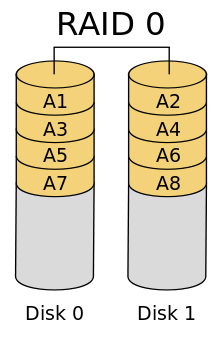

# Raids

Bei allen genannten Konfiguration gilt, dass sich die Anzahl der Platten, welche zugleich ausfallen dürfen, sich je nach Anzahl der im jeweiligen RAID befindlichen Platten ändert. 

## RAID 0

RAID 0 bietet keine Redundanz, sondern lediglich erhöhte Geschwindigkeit, dies wird durch Aufteiling der Daten auf mehrere Festplatten erreicht. Die Aufteilung der Daten wird auch `Striping` genannt. Bei Ausfall einer Festplatte können die Daten nicht komplett wiederhergestellt werden.

## RAID 1

RAID 1 bietet Redudanz, aber keine Erhöhung der Schreibgeschwindkeit. Erzielt wird die Redundanz durch das Spiegeln der Daten auf 2 oder mehr Festplatten verteilt. Man kann theoretisch die Lesegeschwingkeit erhöhen, indem man einzelne Teile der Daten zugleich von verschiedenen Platten liest.

## RAID 5

RAID 5 bietet sowohl höhere Geschwindigkeit als auch Redundanz. Die Daten werden hier in Streifen auf die jeweiligen Platten aufgeteilt. Für jede Reihe von Daten gibt es immer einen Paritätsstreifen. Der Paritätsstreifen kann zur Wiederherstellung eines Verlorenem Streifen genutzt werden. Daher darf in einer RAID 5 Konfiguration maximal eine Festplatte.

## RAID 6

RAID 6 bietet, wie auch RAID 5, bessere Performance und Redundanz. Im Gegensatz zu RAID 5 verkfraftet es jedoch den Ausfall von bis zu zwei Festplatten gleichzeitig. Das liegt daran, dass der RAID 6 die Paritätsinformationen doppelt.

## RAID 10

 
RAID 10 ist eine Kombination aus RAID 0 und RAID 1. Die Daten werden zuerst gestripet und im Anschluss gespiegelt. Dies sorgt für höhere Performance und Redundanz. Es dürfen bis zu zwei Platten gleichzeitig ausfallen, jedoch dürfen in den unterliegenden RAID 1 Konfigurationen niemals beide Platten(alle) ausfallen.

## RAID 01

RAID 01 ist wie auch RAID 10 eine Kombination aus RAID 1 und RAID 0. Der Unterschied ist hier, dass die Daten erst gespiegelt und dann gestripet werden. Das bedeutet, dass hier ein kompletter RAID 0 wegfallen darf.

## RAID 15

RAID 15 ist eine Mischung aus RAID 1 und RAID 5. Diese Konfiguration nutzt mehrere RAID 1 welche sich in einem RAID 5 befinden. Hier darf ein ganzer RAID 1 ausfallen oder eine Platte in jedem RAID 1.

## RAID 51

RAID 51 ist eine Mischung aus RAID 5 und RAID 1. Diese Konfiguration nutzt mehrere RAID 5 5 die in einem RAID 1 sind. Hier dürfen alle RAID 5, bis auf einen, ausfallen oder jeweils eine Platte bei jedem RAID 5.

<!--
## Erklärung Parität

Datenblöcke 110 101 001

XOR(110, 101, 001) = 010

Wegfall von 2(101)

XOR(110,010,001) = 101
-->

## Unterschied zwischen RAID 10 und RAID 01

In RAID 10 darf jeweils ein Teil eines RAID 1 wegfallen und in RAID 01 darf ein kompletter RAID 0 wegfallen.

<!--
## Zwei Prüfungsaufgaben

TODO
-->
