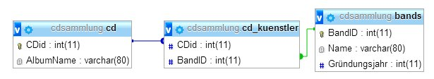

# Deletes

## Schema



## Aufgaben und Lösungen

1. Löschen Sie das Album mit dem Namen `The Wall`
    ```sql
    DELETE FROM cd
    WHERE AlbumName = 'The Wall';
    ```

2. Löschen Sie alle Alben der Gruppe `Pink Floyd`
    ```sql
    DELETE FROM cd
    WHERE
        AlbumName like 'A%'
        AND (SELECT cd_kuenstler.BandID
            FROM cd_kuenstler
            WHERE cd_kuenstler.CDid = cd.CDid)
            =
            (SELECT bands.BandID 
            FROM bands
            WHERE bands.Name = 'Pink Floyd'
            LIMIT 1);
    ```

3. Löschen Sie die Gruppe `Pink Floyd`
    ```sql
    DELETE FROM bands WHERE bands.Name = 'Pink Floyd';
    ```
